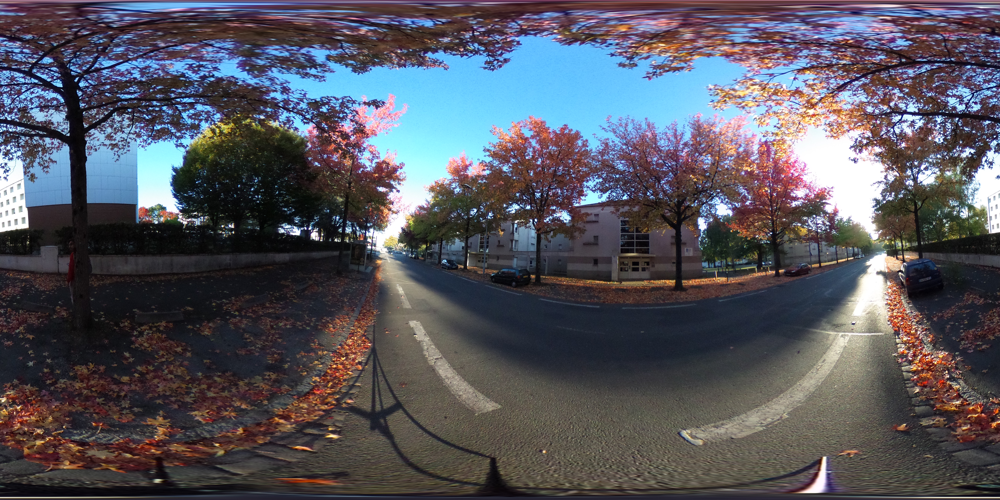
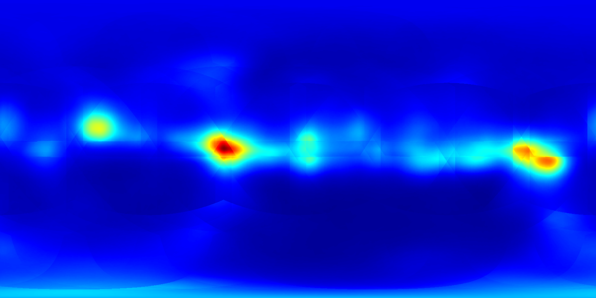

# odisal
This repository contains the pytorch implementation of omni-directional saliency map estimation in [IEICE](https://www.ieice.org/eng_r/index.html) journal paper:
- Takao Yamanaka, Tatsuya Suzuki, Taiki Nobutsune, and Chenjunlin Wu, "Multi-Scale Estimation for Omni-Directional Saliency Maps Using Learnable Equator Bias," IEICE Transactions on Information and Systems, Vol. E106-D, No. 10, 2023. https://arxiv.org/abs/2309.08139




# Downloads
In addition to this repository, download the following zip files, unzip them, and place them under the odisal folders.
- [DataSets.zip](https://drive.google.com/file/d/1zDR8rvIWyMWoC4uxuvh9oYCGTVfFHhj2/view?usp=sharing) (5.94GB): odisal/Datasets
- [pretrained.zip](https://drive.google.com/file/d/1dUtuEAlvceTFln73EODfTjyg-t5xn_to/view?usp=sharing) (928.3MB): odisal/pretrained
- [maps.zip](https://drive.google.com/file/d/15m9dDqT1u7wNVcmCfZqaYElGZlbphSZT/view?usp=sharing) (36.2MB): odisal/program/maps
- [pytorch_dpn_pretrained.zip](https://drive.google.com/file/d/1na7enRRgzMVGq63vyZV1r1E32K4rtpWx/view?usp=sharing) (1.1GB): odisal/program/models/pytorch_dpn_pretrained
- [deepgaze_pytorch.zip](https://drive.google.com/file/d/12ihDSrb62nM2QYoT0ND9ZYLQSm64B24W/view?usp=sharing) (389.3MB): odisal/program/models/deepgaze_pytorch

Since the following folders include only output files, it does not have to be downloaded.
- [logs.zip](https://drive.google.com/file/d/1mIsOeSEPnD9LcD6WwfYoRBWWGeV2mOqj/view?usp=sharing) (2.53GB): odisal/program/logs
- [eval.zip](https://drive.google.com/file/d/13e6Vr-0kHvXjuiB5-GJdc6xyhLzE2DHK/view?usp=sharing) (53KB): odisal/program/eval
- [outputs.zip](https://drive.google.com/file/d/1Jt-3J6e_07Ruv85Wywu-iyPoR0D0Obnh/view?usp=sharing) (72MB): odisal/program/outputs

# Examples
Multi-Scale Estimation (Multi-Angles of View; MAV)
```
> cd program
> python pipeline.py --cfg config/DenseSal_ch512_100_110_120.yaml
```

Signle-Scale Estimation (Single Angle of View; SAV)
```
> cd program
> python pipeline.py --cfg config/DenseSal_BA2_with_features_ch512_100.yaml
```

'pipeline.py' excecutes fine-tuning, estimation, and evaluation for an omni-directional image dataset with the settings in 'program/confing/*.yaml'.

---

A trained model for MAV with DenseSal is avalabile in  
'program/logs/salient360_2018_BA2_with_feature_100_110_120/densesalbi3/ckpt/checkpoint_20230903-195522_model_best.pth.tar'

If you want to estimate saliency maps for omni-directional images (ODI) with the trained model without training, 
1. Comment out 'Train:' and 'EVALUATE:' parts in 'program/config/DenseSal_ch512_100_110_120.yaml'. Only leave the 'ESTIMATE:' part.
2.  Set the path to the model file in 'Resume' in the yaml file.
> ESTIMATE > SETTING > RESUME: logs/salient360_2018_BA2_with_feature_100_110_120/densesalbi3/ckpt/checkpoint_20230903-195522_model_best.pth.tar
3. Run the pipeline.py.
> python pipeline.py --cfg config/DenseSal_ch512_100_110_120.yaml

The estimated ODI saliency maps will be obtained in the 'outputs' folder.

# Settings in config (program/config)
Settings for MainNet (densesalbi3 / dpnsal131_dilation_multipath / deepgaze2e)
> ARCH: densesalbi3

---

Settings for Multi-scale estimation

MAV (Multi-Angles of View)
```
VIEW_ANGLE: [100, 110, 120 ]
USE_MULTISCALE_MODEL: True

DATASET_CFG_PATH: ../DataSets/salient360_2018_BA2_with_feature_100_110_120/salient360_2018_BA2_with_features_E26_1600_800_500_500_100_110_120.cfg
```

SAV (Single Angle of View)
```
VIEW_ANGLE: 100
USE_MULTISCALE_MODEL: False

DATASET_CFG_PATH: ../DataSets/salient360_2018_SVA_100/salient360_2018_SVA_E26_1600_800_500_500.cfg
```

---

Settings for the integration layer (Table 1)

Arch. 1
```
USE_FUSION_LAYER: False
USE_ATTENTION_LAYER: True
USE_BASIC_ATTENTION_LAYER: True
USE_BASIC_ATTENTION_V2_LAYER: False
USE_BASIC_ATTENTION_WITH_FEATURE: False
```

Arch. 2
```
USE_FUSION_LAYER: False
USE_ATTENTION_LAYER: True
USE_BASIC_ATTENTION_LAYER: False
USE_BASIC_ATTENTION_V2_LAYER: True
USE_BASIC_ATTENTION_WITH_FEATURE: False
```

Arch. 3
```
USE_FUSION_LAYER: False
USE_ATTENTION_LAYER: True
USE_BASIC_ATTENTION_LAYER: True
USE_BASIC_ATTENTION_V2_LAYER: False
USE_BASIC_ATTENTION_WITH_FEATURE: True
```

Arch. 4
```
USE_FUSION_LAYER: False
USE_ATTENTION_LAYER: True
USE_BASIC_ATTENTION_LAYER: False
USE_BASIC_ATTENTION_V2_LAYER: True
USE_BASIC_ATTENTION_WITH_FEATURE: True
```

# References
1. Takao Yamanaka, Tatsuya Suzuki, Taiki Nobutsune, and Chenjunlin Wu, "Multi-Scale Estimation for Omni-Directional Saliency Maps Using Learnable Equator Bias," IEICE Transactions on Information and Systems, Vol. E106-D, No. 10, 2023. https://arxiv.org/abs/2309.08139
2. T. Suzuki and T. Yamanaka, "Saliency Map Estimation for Omni-Directional Image Considering Prior Distributions," IEEE International Conference on Systems, Man, and Cybernetics (SMC), 2018, Miyazaki, Japan. 
http://arxiv.org/abs/1807.06329
3.  T. Oyama and T. Yamanaka, "Influence of Image Classification Accuracy on Saliency Map Estimation," CAAI Transactions on Intelligence Technology, vol. 3, issue 3, 2018, pp. 140-152. 
https://digital-library.theiet.org/content/journals/10.1049/trit.2018.1012
https://arxiv.org/abs/1807.10657
4. Akis Linardos, Matthias Kümmerer, Ori Press, and Matthias Bethge, "DeepGaze IIE: Calibrated prediction in and out-of-domain for state-of-the-art saliency modeling," ICCV 2021. 
https://arxiv.org/abs/2105.12441 
https://github.com/matthias-k/DeepGaze

# Versions
The codes were confirmed with the following versions.
- Python 3.9.7
- PyTorch 2.0.0+cu117
- NVIDIA Driver: 510.47.03
- CUDA: 11.6
